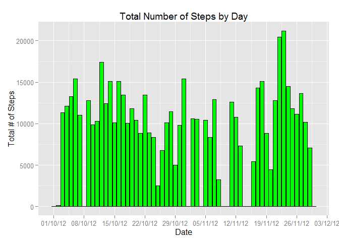
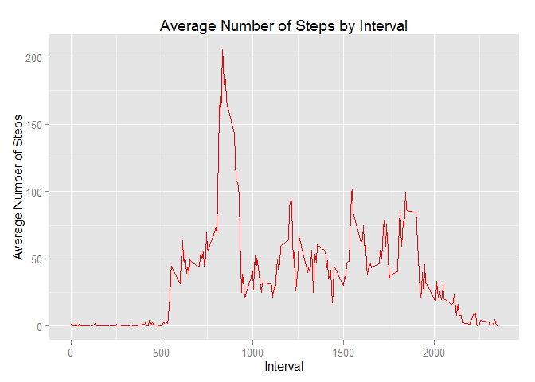
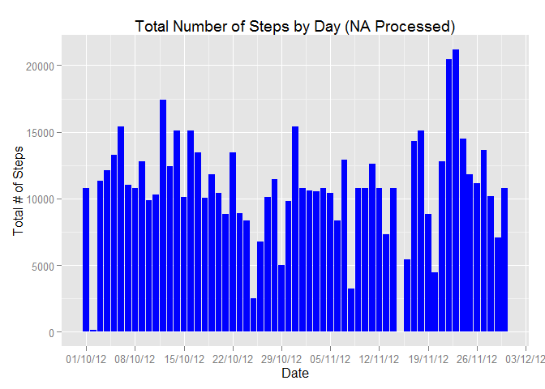
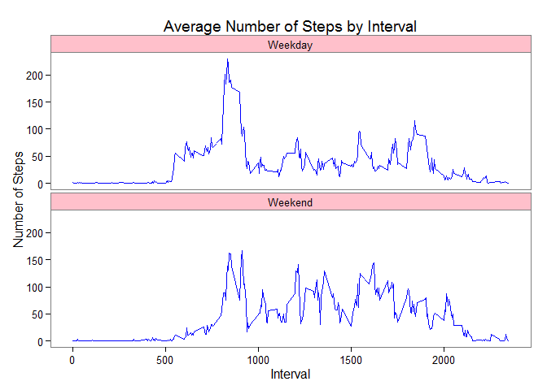

# Reproducible Research: Peer Assessment 1


## Loading and preprocessing the data

```r
#unzip data file from working directory and read
rawActivityData <- read.csv(unz("activity.zip", "activity.csv"),
                         header = TRUE)
# Process/transform the data into a format suitable for analysis
rawActivityData$date <- as.Date(rawActivityData$date)
rawActivityData$steps <- as.numeric(rawActivityData$steps)
rawActivityData$interval <- as.numeric(rawActivityData$interval)
```

## What is mean total number of steps taken per day?
####1. Calculate the total number of steps taken per day


```r
# Aggregate steps by day and calculate sum
aggregateActivityDataByDate <- aggregate(rawActivityData$steps, by = list(rawActivityData$date), FUN = sum, na.rm = TRUE)

# Set column names for aggrgate data set
names(aggregateActivityDataByDate) <- c("date", "steps")

# Make a histogram (barplot) of the total number of steps taken each day
library(scales)
library(ggplot2)
ggplot(aggregateActivityDataByDate, aes(x = date, y = steps)) + 
  geom_bar(stat = "identity", fill = "green", color="black", binwidth = 1000) + 
  labs(title = "Total Number of Steps by Day", x = "Date", y = "Total # of Steps") +
  scale_x_date(breaks = date_breaks("1 week"),
               labels = date_format("%d/%m/%y")) 
```

 

####2. Calculate and report the mean and median of the total number of steps taken per day

Mean of the total number of steps by day:

```r
mean(aggregateActivityDataByDate$steps)
```

```
## [1] 9354.23
```
Median of the total number of steps by day:

```r
median(aggregateActivityDataByDate$steps)
```

```
## [1] 10395
```

## What is the average daily activity pattern?
####1. Make a time series plot (i.e. type = "l") of the 5-minute interval (x-axis) and the average number of steps taken, averaged across all days (y-axis)


```r
# Aggregate steps by interval and calculate mean
aggregateActivityDataByInterval <- aggregate(rawActivityData$steps, by = list(rawActivityData$interval), FUN = mean, na.rm = TRUE)

# Set column names for aggregate data set
names(aggregateActivityDataByInterval) <- c("interval","steps")

# Make a line plot for average number of steps per interval 
ggplot(aggregateActivityDataByInterval, aes(x = interval, y = steps)) + 
  geom_line(color = "red") + 
  labs(title = "Average Number of Steps by Interval", x = "Interval", y = "Average Number of Steps")
```

 

####2. Which 5-minute interval, on average across all the days in the dataset, contains the maximum number of steps?


```r
# Get the interval that contains maximum number of steps in the aggregate data set
aggregateActivityDataByInterval[which.max(aggregateActivityDataByInterval$steps), ]
```

```
##     interval    steps
## 104      835 206.1698
```

## Imputing missing values
####1. Create a new dataset that is equal to the original dataset but with the missing data filled in.


```r
# Calculate and report the total number of missing values in the dataset (i.e. the total number of rows with NAs)
missingValues <- which(is.na(rawActivityData$steps))
length(missingValues)
```

```
## [1] 2304
```

```r
# Create a new dataset that is equal to the original dataset but with the missing data filled in using the average number of step from the other available data for that interval
processedActivityData <- rawActivityData
for(i in missingValues) {
  processedActivityData$steps[i] <- aggregateActivityDataByInterval[which(aggregateActivityDataByInterval$interval == processedActivityData[i, "interval"]), "steps"]
}
processedActivityData$steps <- as.numeric(processedActivityData$steps)

# Aggregate the steps by day and calculate the sum
processedActivityDataByDay <- aggregate(processedActivityData$steps, by = list(processedActivityData$date),
                               FUN = sum)
names(processedActivityDataByDay) <- c("date", "steps")
```

####2. Make a histogram of the total number of steps taken each day


```r
# Make a histogram of the total number of steps taken each day 
ggplot(processedActivityDataByDay, aes(x = date, y = steps)) + 
  geom_bar(stat = "identity",  binwidth = 1000, fill="blue") + 
  labs(title = "Total Number of Steps by Day (NA Processed)", x = "Date", y = "Total # of Steps") +
  scale_x_date(breaks = date_breaks("1 week"),
               labels = date_format("%d/%m/%y")) 
```

 

####3. Calculate and report the mean and median total number of steps taken per day. 

Mean of the total number of steps by day:

```r
mean(processedActivityDataByDay$steps)
```

```
## [1] 10766.19
```
Median of the total number of steps by day:

```r
median(processedActivityDataByDay$steps)
```

```
## [1] 10766.19
```

####4. Do these values differ from the estimates from the first part of the assignment? What is the impact of imputing missing data on the estimates of the total daily number of steps?

The values of mean and median steps by day from the processed data set (with NA filled in with mean steps from the other available data for that interval) are different from the original dataset. After the missing data is filled in, the value of mean and median steps is greater than the original data set.

## Are there differences in activity patterns between weekdays and weekends?
####1. Create a new factor variable in the dataset with two levels - "weekday" and "weekend" indicating whether a given date is a weekday or weekend day.


```r
# Create a new data set with a new added column called dateType to identify weekend vs. weekday data based on the date
processedActivityData <- transform(processedActivityData, 
                      dateType=factor(ifelse(as.POSIXlt(processedActivityData$date)$wday %in% c(0, 6), 
                                                c("Weekend"), c("Weekday"))))
# Aggregate the number of steps by interval and dateType and calculate the mean
processedActivityDataByIntervalDateType <- aggregate(processedActivityData$steps,
                                      by = list(processedActivityData$interval, processedActivityData$dateType),
                                      FUN = mean)

names(processedActivityDataByIntervalDateType) <- c("interval","dateType","steps")
```

####2. Make a panel plot containing a time series plot (i.e. type = "l") of the 5-minute interval (x-axis) and the average number of steps taken, averaged across all weekday days or weekend days (y-axis).


```r
# Make a panel plot to represent average steps per day for weekday vs. weekend 
library(lattice)
xyplot(steps ~ interval|dateType, data = processedActivityDataByIntervalDateType,
       type = "l", layout=c(1, 2),
       main = "Average Number of Steps by Interval",
       xlab = "Interval", ylab = "Average Number of Steps")
```

 
